# Coins Gyaan Store

A full-stack e-commerce platform for exploring and purchasing Indian collectible coins.

## Live Demo

🌐 **Live Website:** [https://coins-gyaan-store.vercel.app/](https://coins-gyaan-store.vercel.app/)


## Screenshots

### User Experience

#### Homepage

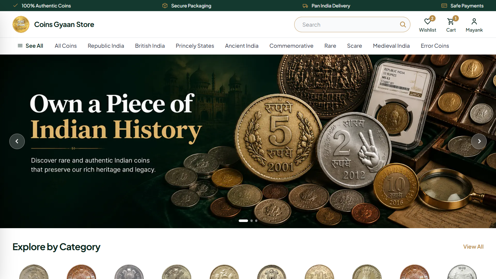

#### Product Catalogue

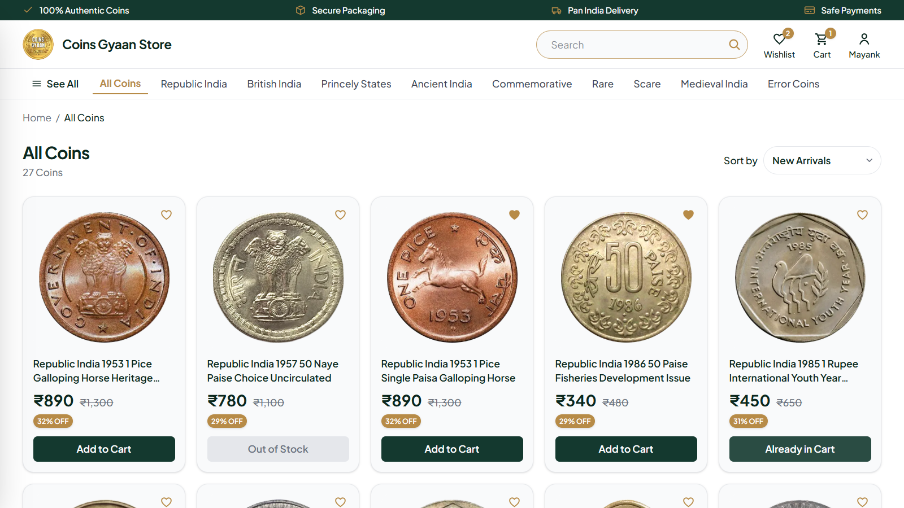

#### Product Details

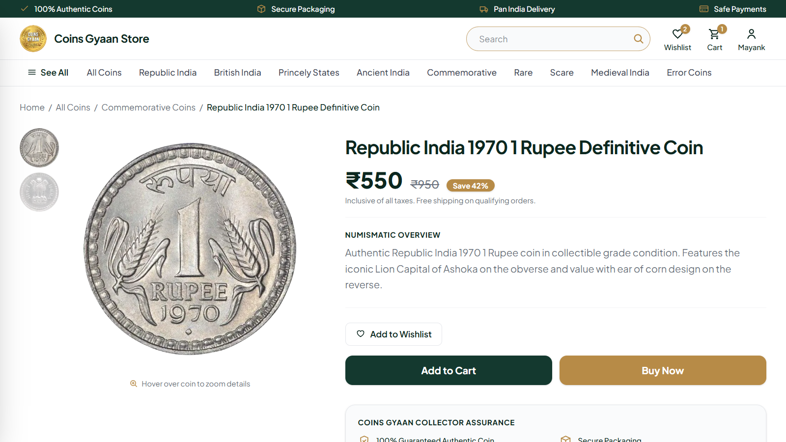

#### Shopping Cart

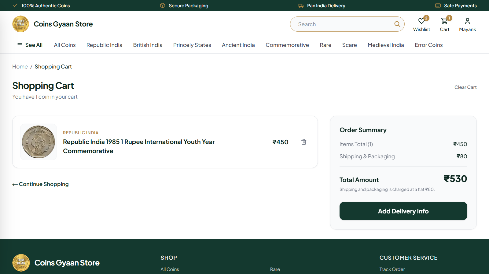

#### Wishlist

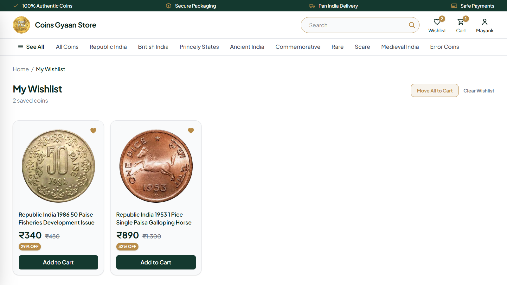

#### Google Authentication

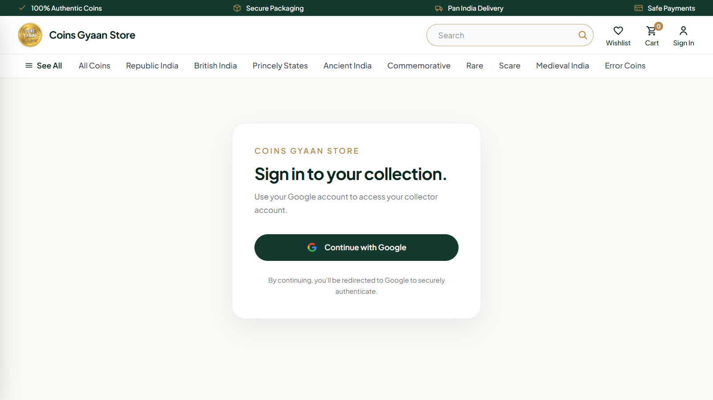

#### My Account

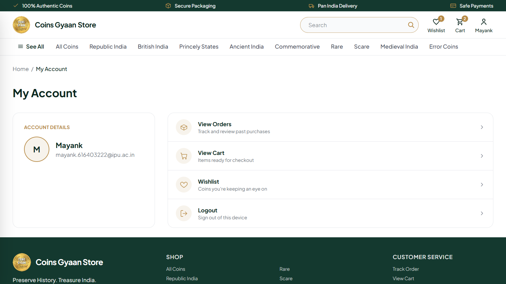

#### Orders

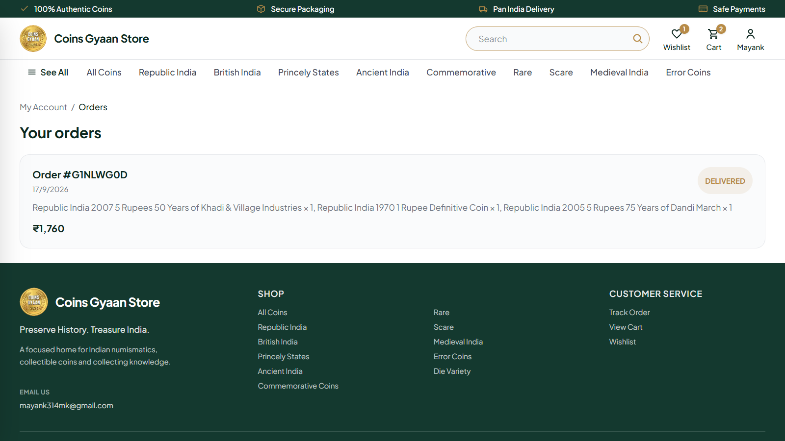

#### Checkout

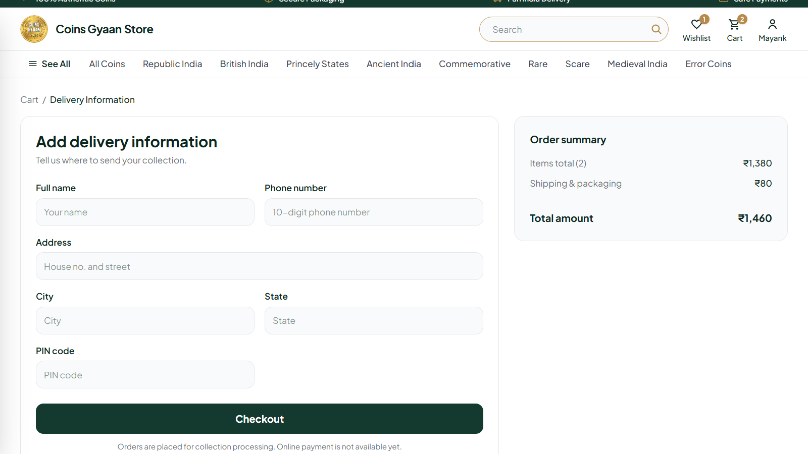

### Admin Dashboard

#### Admin Account

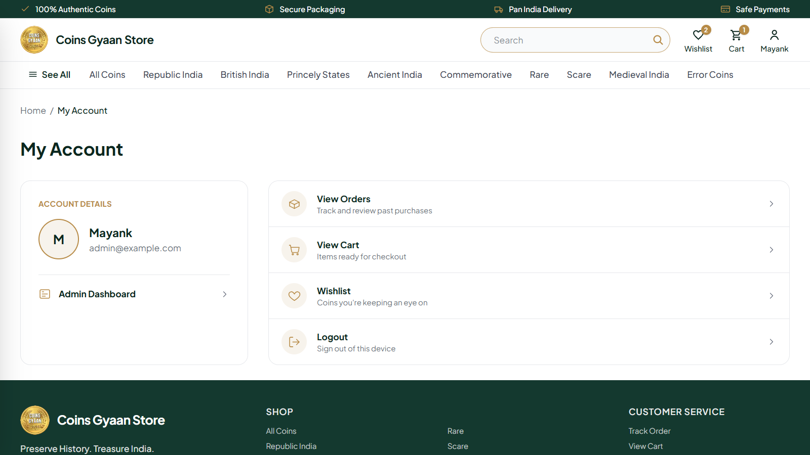


#### Product Management

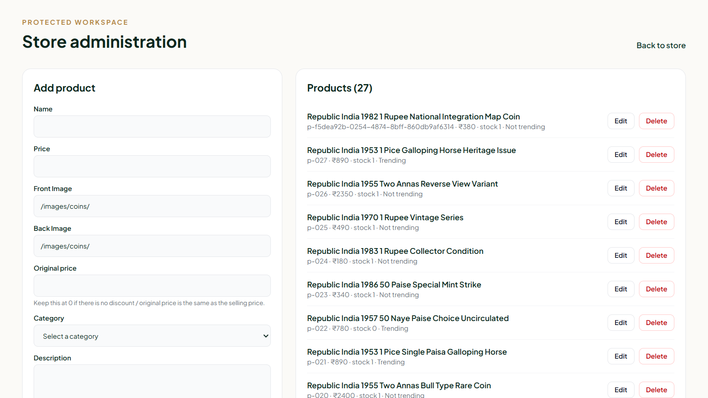

#### Order Management

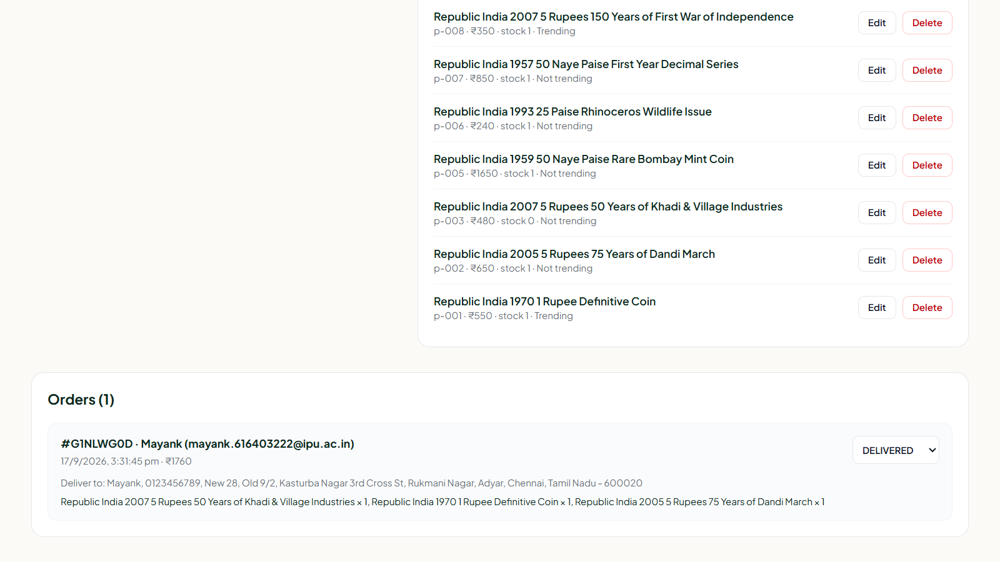

## Features

- Responsive e-commerce storefront
- Hero carousel and category browsing
- Product search
- Category-based browsing
- Product sorting and pagination
- Product detail pages
- Front and back coin images
- Coin image hover zoom
- Discount pricing and original price display
- Stock and out-of-stock handling
- Shopping cart
- Wishlist
- Google OAuth authentication
- User account
- Order history
- Delivery information and checkout
- Protected admin dashboard
- Product management
- Stock management
- Trending product management
- Order management and status updates
- Database-backed products, carts, wishlists and orders

## Tech Stack

- Next.js
- React
- TypeScript
- Tailwind CSS
- Prisma ORM
- PostgreSQL
- Supabase
- Better Auth
- Google OAuth
- Vercel

## Pages

- `/` — Homepage
- `/all-coins` — Coin catalogue
- `/coin/[id]` — Product details
- `/search` — Search results
- `/cart` — Shopping cart
- `/wishlist` — Wishlist
- `/checkout` — Delivery information and checkout
- `/orders` — Order history
- `/account` — User account
- `/auth` — Authentication
- `/admin` — Admin dashboard

## Admin Dashboard

The protected admin dashboard provides basic store management.

Administrators can:

- Add products
- Edit products
- Delete products
- Set selling prices
- Set original prices
- Select product categories
- Add front and back coin images
- Manage stock
- Mark products as trending
- View all products
- View customer orders
- Update order statuses

## Database

The application uses PostgreSQL hosted on Supabase with Prisma as the ORM.

Main models include:

- User
- Account
- Session
- Verification
- Product
- Cart
- CartItem
- Wishlist
- WishlistItem
- Order
- OrderItem

## Authentication

Authentication is implemented using Better Auth with Google OAuth.

Users can sign in with their Google account and access their account, cart, wishlist and orders.

## Inventory

Product stock is stored in the database and checked during purchasing.

When a product reaches zero stock, it remains visible in the catalogue but purchasing is disabled and the product is displayed as **Out of Stock**.

## Getting Started

### 1. Clone the repository

```bash
git clone https://github.com/mayank314mk/coins-gyaan-store.git
cd coins-gyaan-store
```

### 2. Install dependencies

```bash
npm install
```

### 3. Configure environment variables

Create a `.env.local` file:

```env
DATABASE_URL="your-supabase-postgresql-connection-string"

BETTER_AUTH_URL="http://localhost:3000"
BETTER_AUTH_SECRET="your-secret"

GOOGLE_CLIENT_ID="your-google-client-id"
GOOGLE_CLIENT_SECRET="your-google-client-secret"

NEXT_PUBLIC_BETTER_AUTH_URL="http://localhost:3000"
```

### 4. Generate Prisma Client

```bash
npx prisma generate
```

### 5. Run database migrations

```bash
npx prisma migrate dev
```

### 6. Seed the database

```bash
npx prisma db seed
```

### 7. Start the development server

```bash
npm run dev
```

Open `http://localhost:3000` in your browser.

## Project Structure

```text
coins-gyaan-store/
├── app/
│   ├── account/
│   ├── admin/
│   ├── all-coins/
│   ├── api/
│   ├── auth/
│   ├── cart/
│   ├── checkout/
│   ├── coin/
│   ├── orders/
│   ├── search/
│   ├── wishlist/
│   └── page.tsx
│
├── components/
├── context/
├── lib/
│
├── prisma/
│   ├── migrations/
│   ├── schema.prisma
│   └── seed.ts
│
├── public/
│   └── images/
│       └── coins/
│
├── references/
├── AGENTS.md
├── next.config.ts
├── package.json
└── README.md
```

## Future Improvements

- Razorpay payment integration
- Shipping provider integration
- Email notifications
- Cloud image storage
- Customer reviews and ratings
- Coupons and promotional codes
- Advanced admin analytics

## License

This project was built as a personal portfolio project.

© 2026 Coins Gyaan Store. All rights reserved.